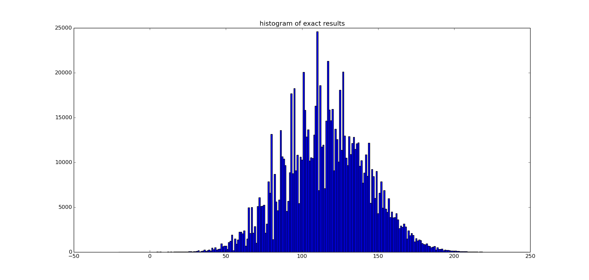

# qwixxmaster

A command line qwixx game

## About

The current version  of **qwixxmaster** is only for the solitar mode: only one player tries to maximize the result. The use of the results for evaluation for moves in a game of two or more players is only of limited advantage, because the algorithm does not take the strategy of the other player into the acccount - which is a very important aspect of the game.

For the calculation, the dynamic programming is used. After utilizing all symmetries there are `2*10^7` states, 2/3 of which can not be reached, because the game ends before they can be reached, so only about `6*10^6` must be calculated and for every state about `3*10^4` combination of dices to be evaluated. Which is feasible within one or two days on a sigle core. An alternative approach is to try out only some of the combination for every state (e.g. 100 or 1000).

## How to use

To build **qwixxmaster**:
    
    make
    
To run:

    bin/qwixxmaster

or 

    make run
    
To find more information type:

    >>>help
    
in the qwixxmaster terminal.
    
### Advanced usage

For using more than 2 (default, which is pretty small to get meaningful results) random dice rolls to evaluate a state:

    bin/qwixxmaster -s N
    
For `N=0` every possible dice roll will be used for the evaluation, otherwise only random `N`.

For loading a dynamic programming memory, stored by a previous run of the program:

    bin/qwixxmaster -m <memory file>
 
Use

   make create_memory 
   
to create a perfect strategy for the solitar game. Wait for one or two days to get results:)
    
## Results so far

### One player

The brute force calculation yields `115.911` points as expected result for a perfect strategy. 
If one doesn't use the brute force evaluation of the underling dice roll distribution but approximates it with 1000 random rolls so the calculated expectation is `116.175`. However in a run of `10^6` simulated games, the 1000-approximation can not score as expected: on average it scores only `115.91 +/- 0.03` - the error of the estimation is statistically significant.

For the exact calculation the average score was `115.96 +/- 0.03` and thus slightly better than predicted (but still inside of 2*sigma deviation), so one could conclude  that the expectation gets confirmed.

That is what the point distribution looks like:

There is .001% probability to end up with negative score and 0.086% probability to get more than 200 points. The most probable result is 110. Looking at the head-to-head comparison between the exact and 1000-approximation, the score is  50.4% : 49.6% and 67% of games ending with the same number of points.

Compared to other approximations:

| approximation | expected | achieved | score with exact |
|---------------|----------|----------|------------------|
| exact         | 115.91   |  115.96  |   50.0:50.0      |
| 1000          | 116.18   |  115.91  |   50.4:49.6      |
| 100           | 117.13   |  115.16  |   52.8:47.2      |
| 10            | 118.31   |  110.30  |   61.0:39.0      |
| 2             | 160.84   |   83.19  |   81.6:18.4      |
 

Approximations 1000 and 100 can be used for practical purposes without much precision loss, approximation 10 is already of a worse quality.

### Two "friendly" players

To start a game with more than one player:

    bin/qwixxmaster -n N
    
with `N` - the number of players. In this mode there is always 'N-1' short rolls (only two dices, instead of six) between two normal six dice rolls, which the player can just skip.

The possibility that the other player could end the game is not taken into the condsideration for this game mode, so only the average number of points is considered. For our experiments 1000-approximation is used.

For the first player the expected score is `131.175`, for the second player it is slightly higher (by `0.6` points): 131.786. Both are, as can be expected, higher as the score in the single player mode (by `15` points). However the gap between the first and the second player is not very big, and it is unclear whether the second player has an advantage in the real play, where both players make decisions taking into the account the situation of the other player.

The predictions by the 1000-approximation where checked with a 10^6 game simulations, for which the first player scored  `130.879 +/- 0.028` on average and the second - `131.457 +/- 0.028`. Both values are about `0.3` points off from the predicted results, and thus comparable with the errors made for single player mode. This also means, that the program has no big bugs in two-player mode.

Another question is, how much difference is between strategies for single player and two players. For this we take the two-player evaluations and use them for making decisions in a single player game. The difference between the strategies is not very big: `115.635 +/- 0.029` could be achieved, `0.3` points worse than the "right" 1000-approximation but `0.5` points better(!) than the right 100-approximation.

### Three "friendly" players

For three player mode, our 1000-approximation yields the following results:

| player | prediction| achieved (10^6 runs) | error of prediction |
|--------|-----------|-----------|-------------------|
| 1.     | 143.065   |  142.724  |  0.341            |
| 2.     | 144.213   |  143.898  |  0.315            |
| 3.     | 143.634   |  143.285  |  0.349            |

Another player brings additional 12 points on average. The second player, as could be expected, is in the best position having 1.1 points advantage over the first player and 0.6 points over the third player.

The strategy difference to the one-player-mode is widening and usage of the wrong one results in average 115.10 points, which means a 0.5 points drop compared to the usage of the two-player strategy.

### Two "competitive" players

For mode in which two players are considering eachother best options and trying to maximize the probability of winning/not lossing, the exact results don't seem to be achievable. Thus a heuristic must be used to reach an acceptable level of play.

Status: TODO.
